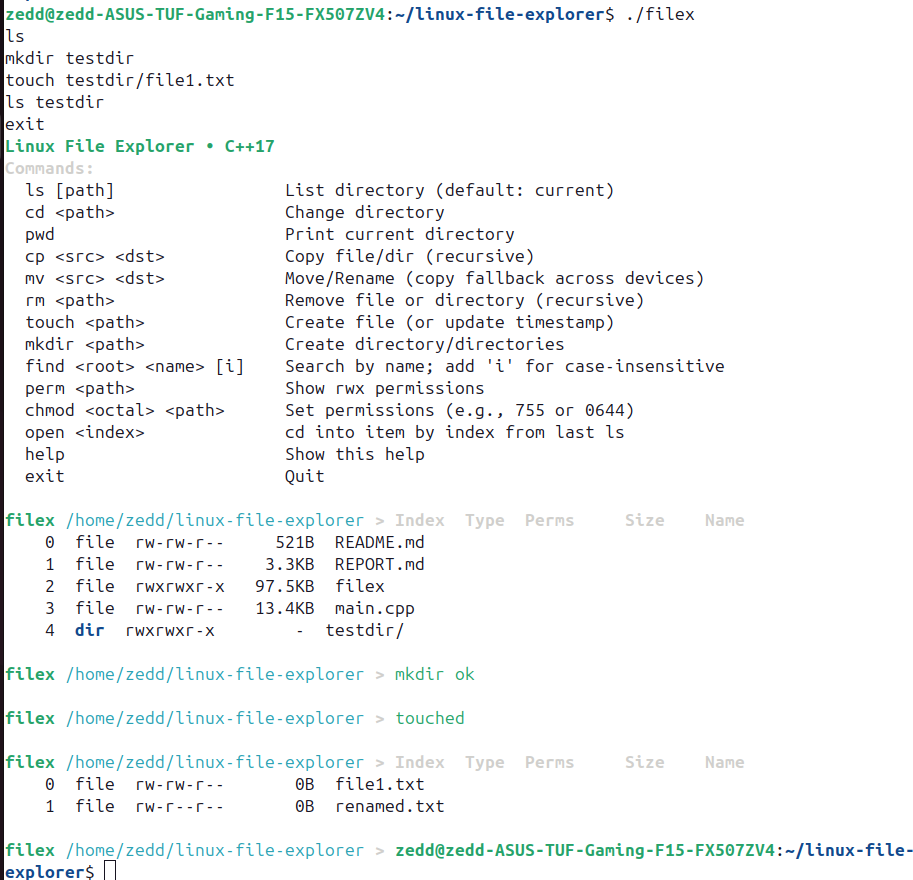
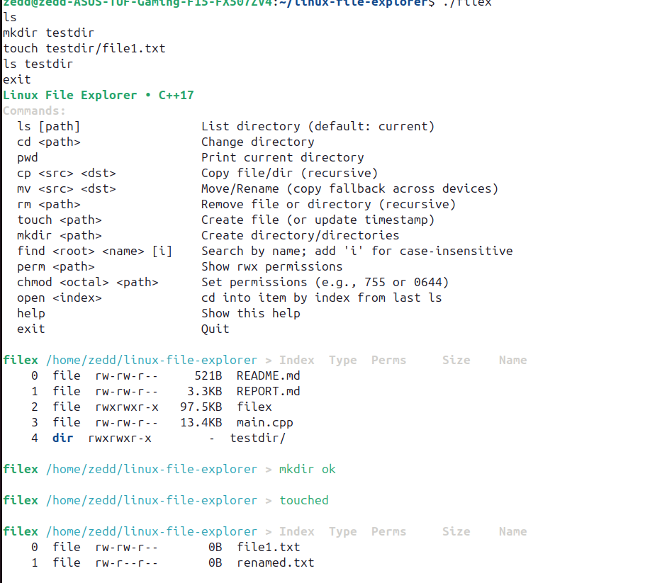
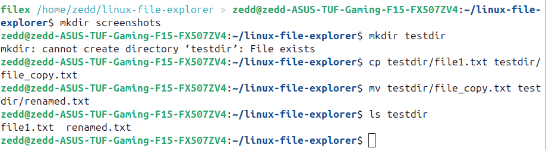
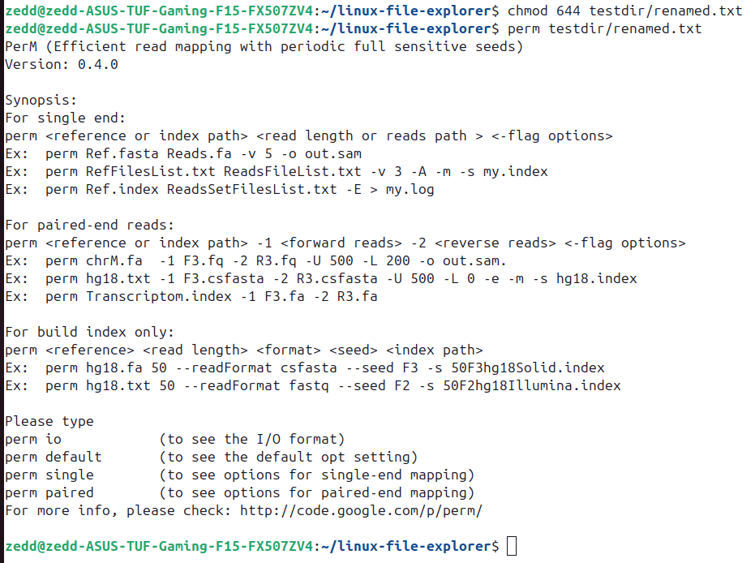
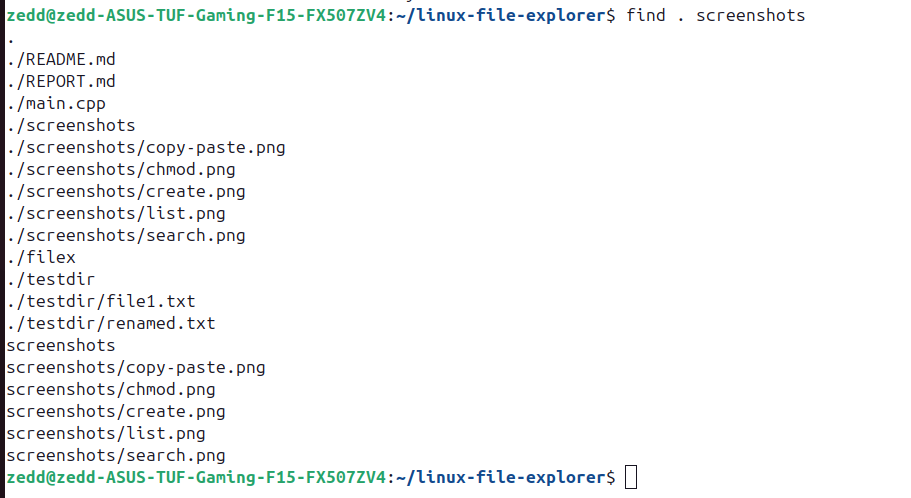

<div align="center">

# **Linux File Explorer (C++17)**  
A fast, console-based file explorer for Linux. It lists directories with metadata, lets you navigate with indices,
and supports everyday ops (`cp`, `mv`, `rm`, `touch`, `mkdir`), permission view/change, and recursive search—clean,
robust, and ready for demos.

</div>

## 🚀 Features

| Feature | Description |
|--------|-------------|
| **List directories/files** | Display directory contents with metadata. |
| **Navigate folders** | Move through directories using paths. |
| **Create/Delete** | Make or remove files and directories. |
| **Copy & Move** | Transfer and rename files easily. |
| **Change Permissions** | Modify `rwx` permission bits. |
| **Search Files** | Recursive search by file name pattern. |

---

## 🧠 How it works
```mermaid
flowchart TD
    A[User command line] --> B[Parser]
    B -->|validates| C[Command Dispatcher]
    C --> D[List/FS Ops via std::filesystem]
    D --> E[Format + Colorize]
    E --> A

# Include a file tree (Mermaid)
```md
## 📁 Project structure
```mermaid
flowchart TB
    R[Repo Root]
    R --> README[README.md]
    R --> REPORT[REPORT.md]
    R --> VIVA[VIVA_QA.md]
    R --> DEMO[demo_script.md]
    R --> CODE[main.cpp]
    R --> SHOTS[screenshots/]
    R --> GIT[.gitignore]
    R --> LIC[LICENSE]

---

## 📸 Feature Demonstration (Screenshots)

### 5.1 List Directory


### 5.2 Create Directory & File


### 5.3 Copy & Move Files


### 5.4 Change Permissions


### 5.5 Search Files


---

## 🧠 Skills Demonstrated
- Linux filesystem & directory traversal
- C++17 `<filesystem>` API usage
- Command parsing & interactive CLI design
- File permissions (`chmod`) & path handling
- Recursive searching & error handling

---

## 🛠 How to Compile & Run

```bash
g++ -std=gnu++17 main.cpp -o filex
./filex


## 📂 Project Structure

linux-file-explorer/
├── 🧠 main.cpp # Core C++ source code (file explorer implementation)
├── 📄 REPORT.md # Capstone project report with explanations & screenshots
├── 📘 README.md # Documentation & usage guide (this file)
├── 📜 LICENSE # MIT License for open-source use
├── 🖼️ screenshots/ # Demonstration images used in report & README
│ ├── 🖼️ list.png # Directory listing output
│ ├── 🖼️ create.png # Create directory + file example
│ ├── 🖼️ copy-move.png # Copy and move operations demonstration
│ ├── 🖼️ chmod.png # Permission modification example
│ └── 🖼️ search.png # Recursive file search demonstration
└── 📁 testdir/ # Example folder used during testing
├── 📄 file1.txt
└── 📄 renamed.txt
